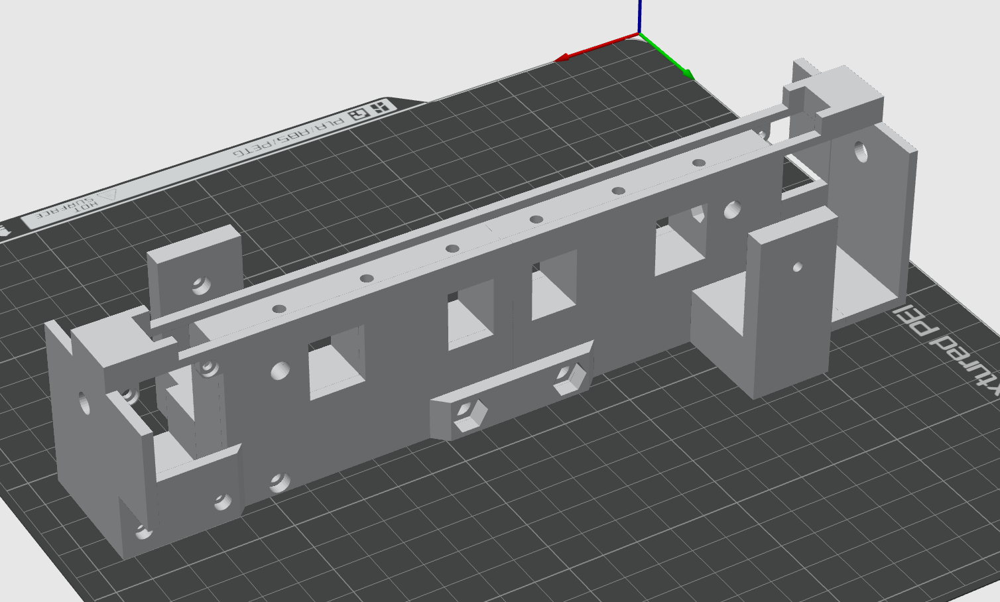
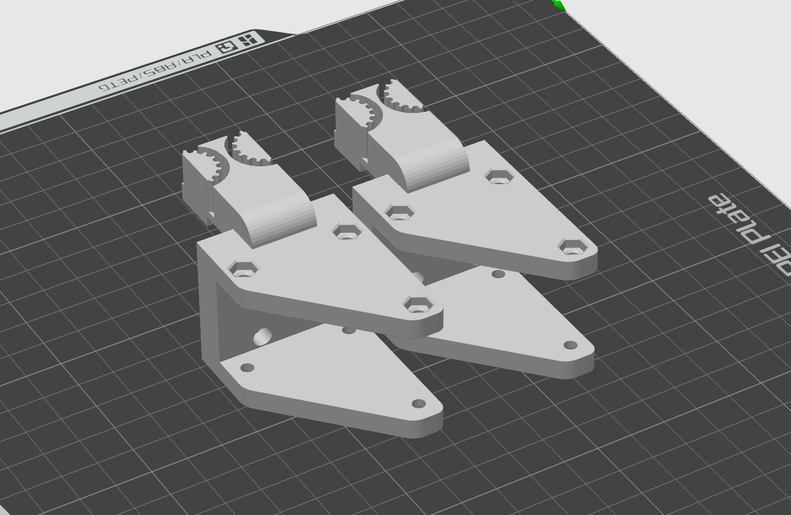
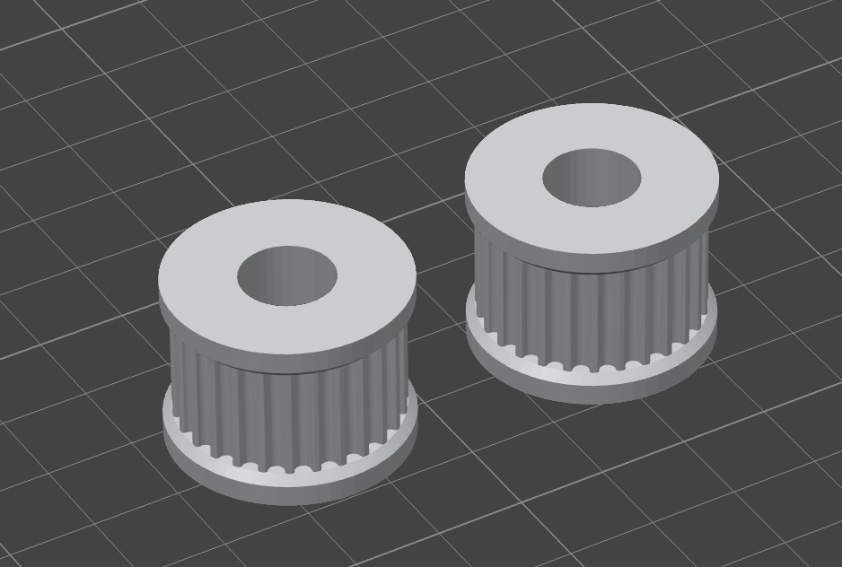
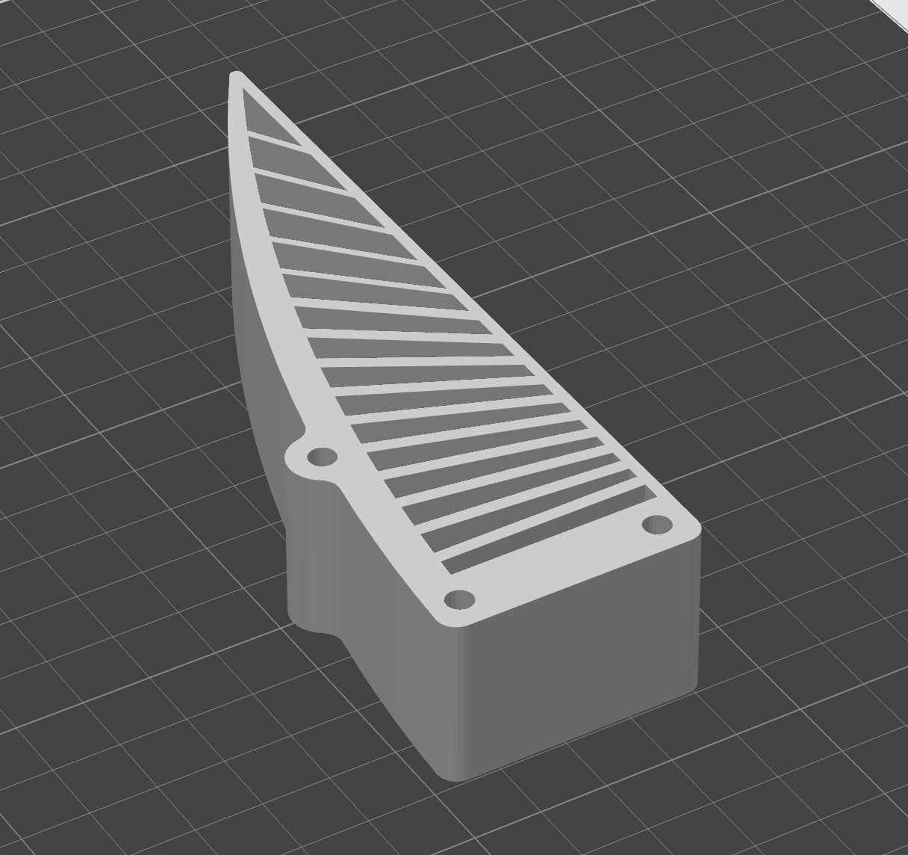

# 3D Printing Guide

There are no brand restrictions for the 3D printer, as long as it can print TPU/PLA/PETG. Most mainstream printers should work. I personally use BambuLab P1S and Creality Ender V2.

Only the fingertip needs to be printed in TPU. All other parts can use rigid materials like PLA, PETG, or ABS.

Parts to print:

1. **Frame** - [holder_base.stl](./print_parts/holder_base.stl)
   - Recommended infill > 45% for strength. 100% is also fine.
   - 

2. **Fingertip Holder** × 2 - [figure_tip_holder.stl](./print_parts/figure_tip_holder.stl)
   - Recommended infill 100%
   - 

3. **Idler Pulley** × 2 - [idler_puller.stl](./print_parts/idler_puller.stl)
   - Recommended infill 100%
   - 

4. **Driving Pulley** × 2 - [driving_pulley.stl](./print_parts/driving_pulley.stl)
   - Recommended infill 100%
   - 

5. **UMI Fingertip** × 2 - [UMI_figure_tip.stl](./print_parts/UMI_figure_tip.stl)
   - Printed in TPU with 100% infill. Print one at a time, not both together, as TPU tends to string.
   - 