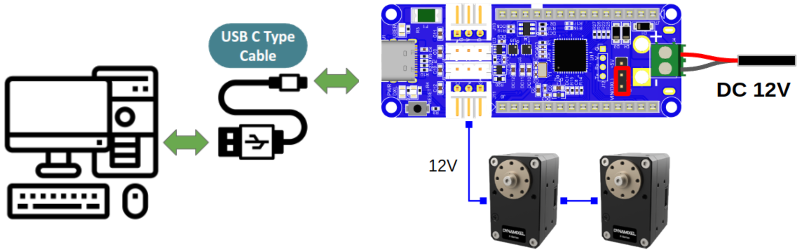

# Assembly Guide

Assembly is straightforward and should take about 15 minutes.
Refer to [BOM.md](BOM.md) for purchasing required components and [3D_printing_guide.md](3D_printing_guide.md) for 3D printed parts. Additional tools needed include tape, screwdriver set, and scissors.

## 1. Install Idler Pulley

- Follow 1️⃣: Insert the two flange bearings from left and right.
- Follow 2️⃣: Place the pulley (without pin) into position.
- Follow 3️⃣: Insert the pin into the hole. Due to printing tolerances, it may not slide in smoothly. Use a hammer to gently tap it in if needed.
- Secure the pin on the side with a 20mm M3 screw and nut to prevent it from coming loose.

## 2. Install Linear Rail

Install two M3 × 10mm screws in the middle to secure the linear rail. Use nuts to fasten from below.

## 3. Install Motor and Pulley

- Follow 1️⃣: Remove the two original screws from the bottom of the motor.
- Follow 2️⃣: Place the motor into the frame and install the two included motor screws.
- Follow 3️⃣: Secure the pulley to the motor using four M2 screws.

## 4. Install Finger and Belt

- Follow 1️⃣: Mount the fingertip holder to the slider using M3 screws.
- Follow 2️⃣: Install the fingertip.
- Follow 3️⃣: Secure the timing belt in the holder. Ensure it's tensioned properly to prevent tooth skipping.

## 5. Wiring and Final Assembly
Connect the two motors and OpenRB-150 using the included cables. Connect the AC power adapter to one end of the OpenRB-150 (ensure correct polarity). Use the USB-C cable on the other end to communicate with the host computer.

The included cables are relatively short, so you may need to extend them using Dupont wires. Secure connections with tape. The OpenRB-150 can be connected to the motors with a long cable, allowing you to mount the board at the back of the robot rather than on the gripper itself.

I designed a mounting box for this purpose, secured with M2 self-tapping screws. See:
- [openrb150_box_base.stl](./print_parts/openrb150_box_base.stl)
- [openrb150_box_cover.stl](./print_parts/openrb150_box_cover.stl)

