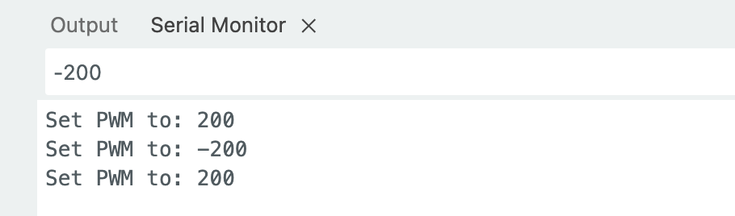

# Code Setup and Usage Guide

## Prerequisites

This guide assumes you're using the OpenRB-150 board with Arduino. If you're new to Arduino, we recommend learning the basics first. Configure your Arduino IDE according to the official documentation: [OpenRB-150 Arduino IDE Setup](https://emanual.robotis.com/docs/en/parts/controller/openrb-150/#install-the-arduino-ide).

## 1. Motor Detection and Setup

Use `code/openrb150/scan_ids` to verify successful connection and detect motors. Motors ship with ID 1 by default. In this example, one motor has been set to ID 2.

Note that 57600 is the baud rate for OpenRB-150 to motor communication, not PC to OpenRB-150. Default is 57600, but we'll upgrade to 2000000 later for better performance.

Expected output when motors are detected:
```
SCAN PROTOCOL 2
SCAN BAUDRATE 57600
ID : 1, Model Number: 1060
ID : 2, Model Number: 1060
SCAN BAUDRATE 115200
SCAN BAUDRATE 1000000
SCAN BAUDRATE 2000000
SCAN BAUDRATE 3000000
Total 2 DYNAMIXEL(s) found!
```

## 2. Motor ID Configuration

Motors ship with ID 1 by default. We'll change one to ID 2. Connect only one motor at a time, as the code detects ID 1 and changes it to 2.

Use: `code/openrb150/update_motor_id/update_motor_id.ino`

Set the source and target IDs:
```cpp
const uint8_t source_id = 1;
const uint8_t new_id = 2;
```

Expected output:
```
PROTOCOL 2.0, ID 1: ping succeeded!, Model Number: 1060
ID has been successfully changed to 2
```

## 3. Single Motor PWM Test

Load test code to verify PWM control of individual motors.

Use: `code/openrb150/test_single_motor_control/test_single_motor_control.ino`

Configure the target motor ID:
```cpp
const uint8_t DXL_ID = 2;    // Specify Motor ID here
```

After uploading, use Arduino IDE Serial Monitor to test PWM values. Enter values like 200 or -200 (range: -885 to +885) to see forward/reverse rotation.



## 4. Main Gripper Control Code

Once testing is successful, upload the main gripper control code.

Use: `code/openrb150/control_gripper_width_force/control_gripper_width_force.ino`

Configure baud rates and other settings at the top of the file. OpenRB-150 to motor communication defaults to 57600. See step 5 for upgrading to 1000000.

After uploading, you'll need a Python script for control and feedback. This guide uses ROS 1. ROS-independent versions may be available later.

## Serial Port Configuration

Serial ports vary by operating system, so we identify them by serial number.

1. Run `code/force_control_gripper/scripts/check_serial_number.py` to identify device information
2. Update `code/force_control_gripper/force_gripper/config/devices.yaml` with gripper device info for automatic detection

## Installation

### Package Installation

Navigate to the package directory and install in development mode:

```bash
cd /Users/hui/workspace/force_gripper_hardware/code/force_control_gripper
pip install -e .
```

This will install the `force_gripper` package with its dependencies, allowing you to use the utility functions for serial port detection.

## ROS-Based Control

Run `python code/force_control_gripper/force_gripper/gripper/gripper_ros.py` (requires ROS core to be running).

This establishes communication with the gripper.

## ROS-Independent Interactive Control

For ROS-free operation, use the interactive control script: `code/force_control_gripper/scripts/control_gripper_single_file.py`

Launch the script:
```bash
python code/force_control_gripper/scripts/control_gripper_single_file.py
```

Then enter commands at the `gripper>` prompt:

```
gripper> init          # Initialize
gripper> open          # Fully open
gripper> pos 0.5 0.5   # Set position (0.0-1.0)
gripper> pwm 0.3 -0.3  # PWM control (-1.0 to 1.0)
gripper> state         # Show current status
gripper> help          # Show help
gripper> quit          # Exit
```

If a status serial port (CH340) is available, real-time status will be displayed. Otherwise, status shows as null.

## 5. Optional: Motor Baud Rate Optimization

Improve communication speed by modifying motor baud rates.

Use: `code/openrb150/modify_motor_bitrate/modify_motor_bitrate.ino`

Configure motor ID and target baud rate at the top of the file. Default is 57600. Testing shows 1000000 provides significant speed improvements.